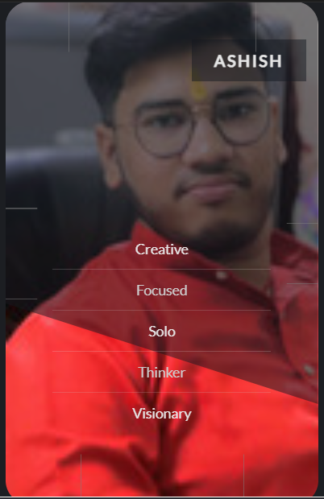

# 🃏 UI - Flip Card (Accessible with :focus-within)

A minimal, accessible flip card effect using only HTML & CSS.  
Designed to be responsive and keyboard-friendly using the `:focus-within` pseudo-class — no JavaScript needed.

[🔗 Live Demo on CodePen](https://codepen.io/giellzsf-the-bashful/pen/xbGBZPP)


---

## 👤 About the Developer


**Ashish Ranjan**  
🚀 Developer of this game  
💬 "I believe in building simple tech that solves real-world public problems."  
🔗 GitHub: [Ashishhhx07](https://github.com/Ashishhhx07)

<br clear="left" />

---


## ✨ Features

- Flip animation on hover and keyboard focus
- Pure HTML + CSS (no JavaScript)
- Mobile-responsive design
- Accessibility via `:focus-within`
- Easy to customize for your own content

---

## 📸 Demo Screenshot




---

### 📁 Clone This Repo
```bash
git clone https://github.com/Ashishhhx07/UI---Flip-Card-.git
cd UI---Flip-Card-

---

🛠️ Folder Structure

Flip-Card/
├── index.html       # Main HTML file
├── style.css        # CSS for flip effect
├── script.js        # (Optional, if used)
├── ashish.jpg       # Developer image for README
├── LICENSE.txt
└── README.md

---

## 🌍 Browser Compatibility

| Browser      | Supported |
|--------------|-----------|
| Chrome       | ❌        |
| Firefox      | ✅        |
| Edge         | ✅        |
| Safari       | ✅        |
| Opera        | ✅        |
| Mobile Browsers | ✅     |

---